# Diagrams: Favorite Events Functionality

> These diagrams accompany the [PRD](./prd-favorite-events.md). All diagrams use [Mermaid](https://mermaid.js.org/) and render natively on GitHub, GitLab, and VS Code (Markdown Preview).  
> **New components** are highlighted in green throughout.

| #   | Diagram                                                                              | Audience           |
| --- | ------------------------------------------------------------------------------------ | ------------------ |
| 1   | [System Context](#1-system-context)                                                  | All stakeholders   |
| 2a  | [Add Favorite (authenticated)](#2a-add-favorite-authenticated)                       | Frontend / QA      |
| 2b  | [Remove Favorite (authenticated)](#2b-remove-favorite-authenticated)                 | Frontend / QA      |
| 2c  | [Unauthenticated click](#2c-unauthenticated-user-clicks-favorite)                    | Frontend / QA      |
| 2d  | [Sign-in bootstrap](#2d-sign-in--favorites-bootstrap)                                | Frontend / Backend |
| 2e  | [Favorites tab load](#2e-favorites-tab-load-profile-page)                            | Frontend / Backend |
| 2f  | [Sign-out clear](#2f-sign-out--favorites-cleared)                                    | Frontend           |
| 3   | [Data Model (ER)](#3-data-model-er-diagram)                                          | Backend / DBA      |
| 4   | [Frontend component architecture](#4-frontend-component-architecture)                | Frontend           |
| 5   | [Redux state flow](#5-redux-state-flow--optimistic-update--rollback)                 | Frontend           |
| 6   | [Backend module structure](#6-backend-module-structure-pantry-registration-api-node) | Backend            |

---

## 1. System Context

How the three services interact when a user favorites an event. Cognito issues the JWT that authorizes write operations; the finder API is queried separately to hydrate event details for the Favorites tab.

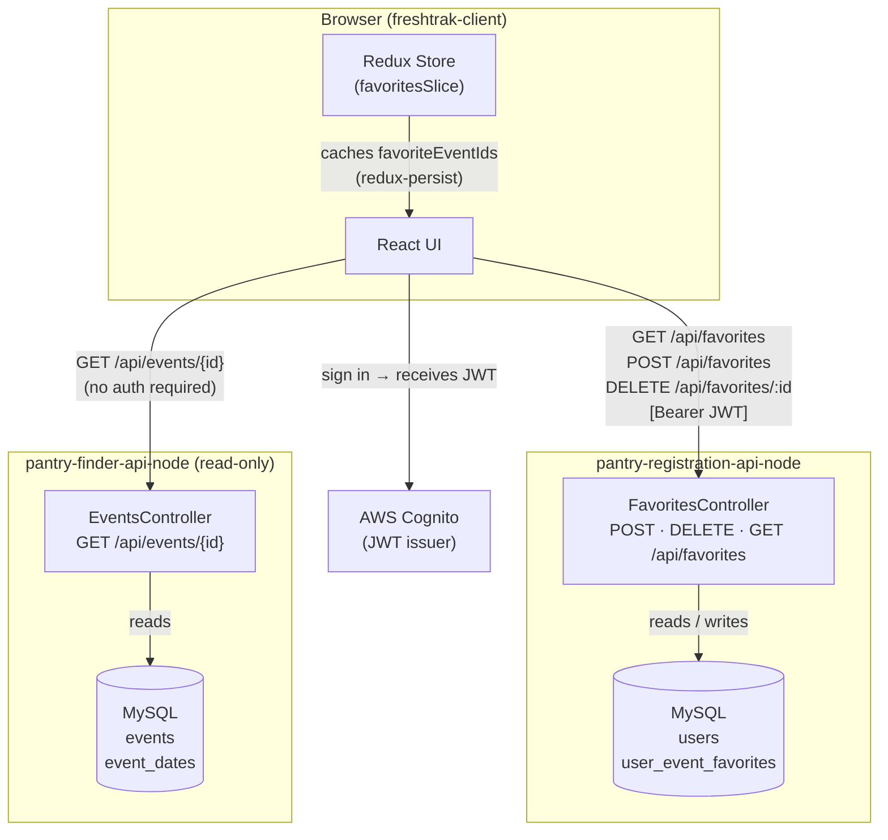

---

## 2. Sequence Diagrams

### 2a. Add Favorite (Authenticated)

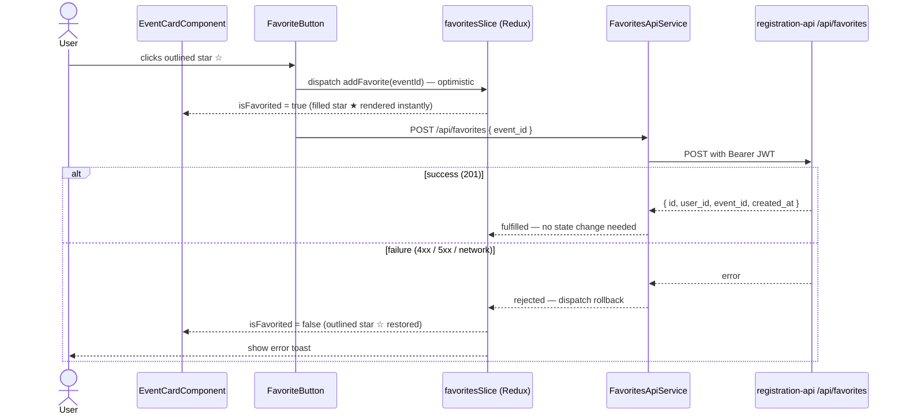

### 2b. Remove Favorite (Authenticated)

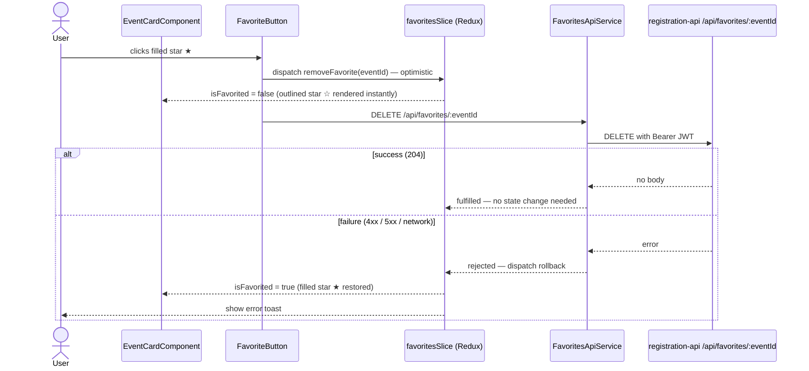

### 2c. Unauthenticated User Clicks Favorite

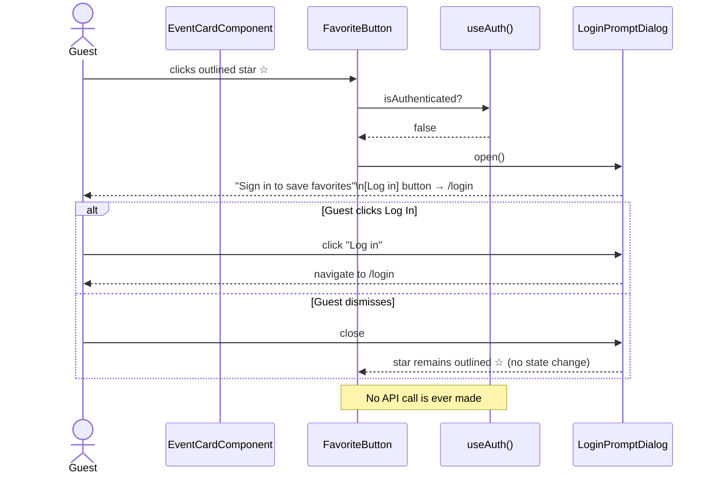

### 2d. Sign-In — Favorites Bootstrap

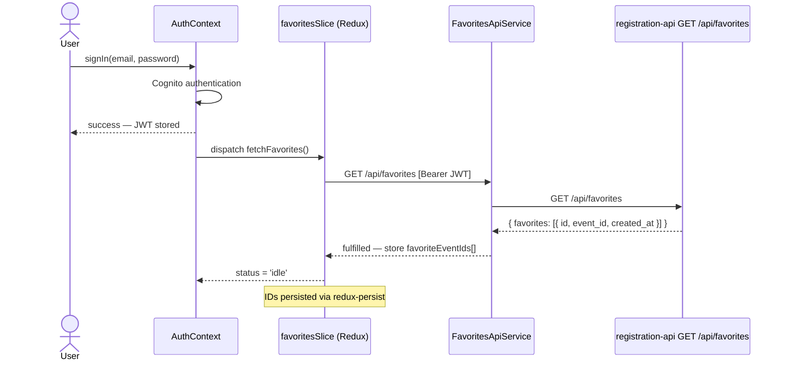

### 2e. Favorites Tab Load (Profile Page)

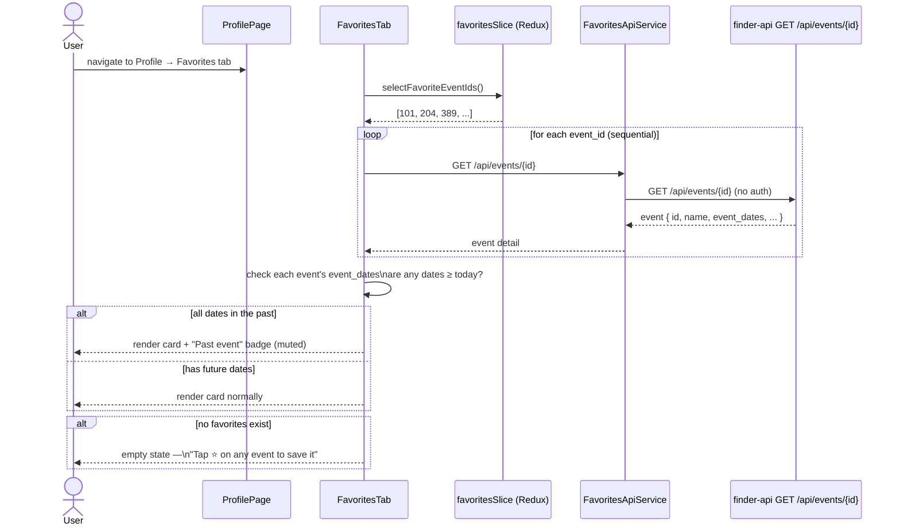

### 2f. Sign-Out — Favorites Cleared

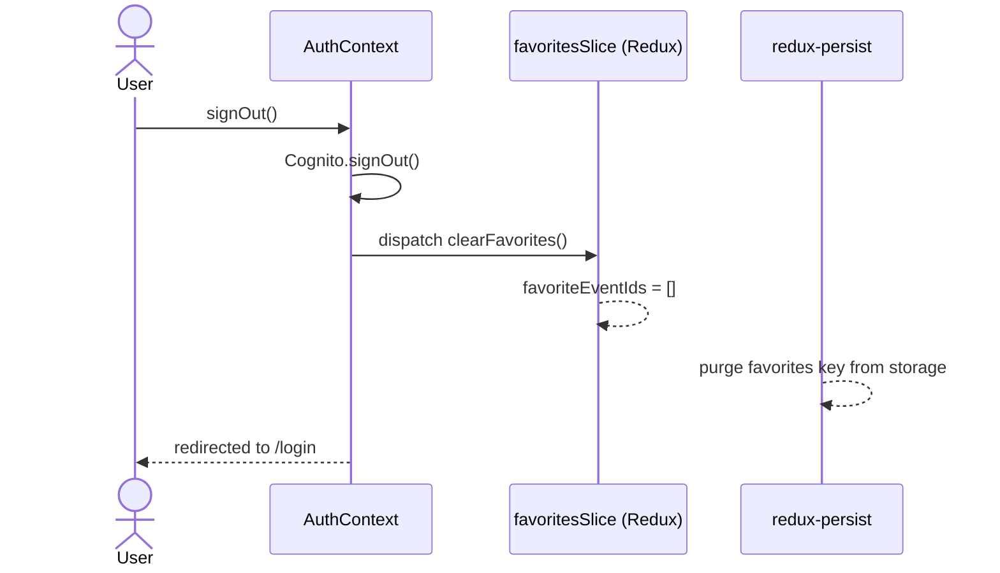

---

## 3. Data Model (ER Diagram)

The new `user_event_favorites` junction table lives in the **pantry-registration-api-node** database. `event_id` is a foreign reference to the `events` table in the **pantry-finder-api-node** database (cross-service integer reference — no enforced DB-level FK across databases).

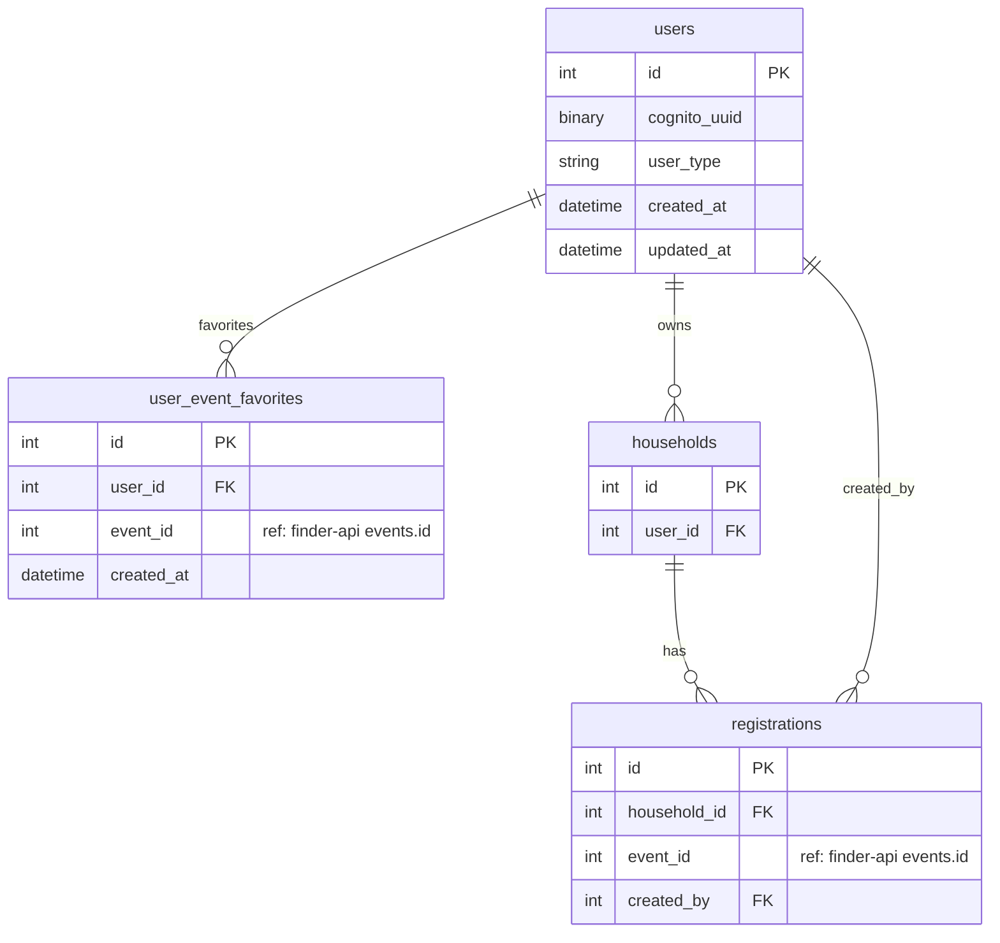

> **Cross-database note:** `event_id` in both `user_event_favorites` and `registrations` is an integer reference to `pantry-finder-api-node`'s `events` table. This pattern already exists in `registrations` and is the established cross-service convention.

---

## 4. Frontend Component Architecture

Where the new pieces fit within the existing React component tree.

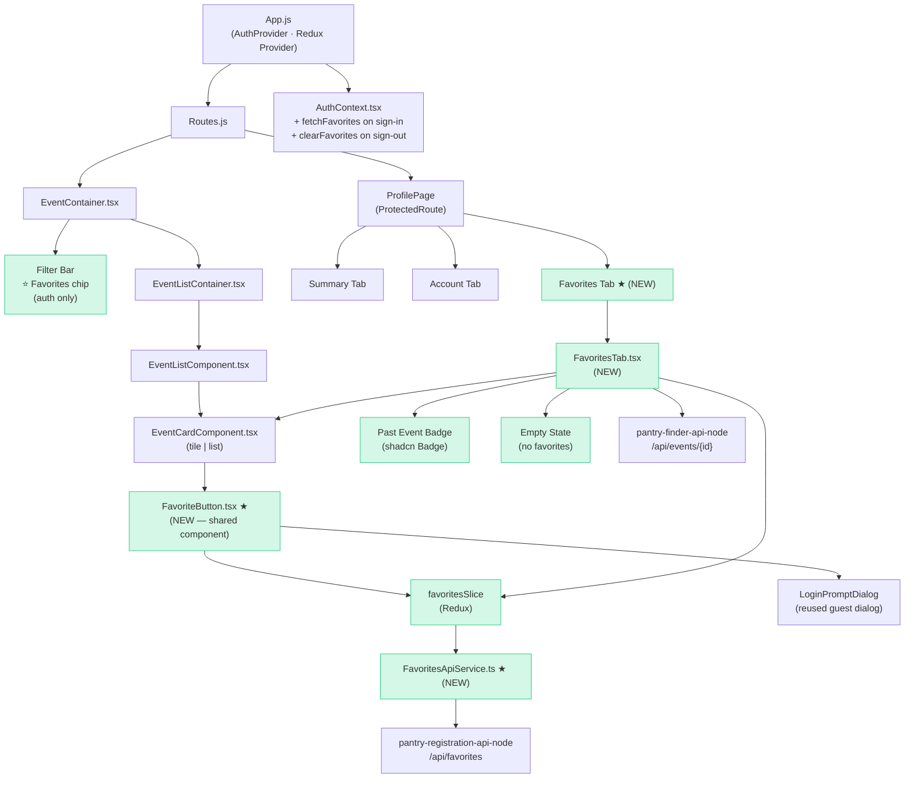

> Nodes highlighted in green are **new** additions. All other nodes are existing code.

---

## 5. Redux State Flow — Optimistic Update & Rollback

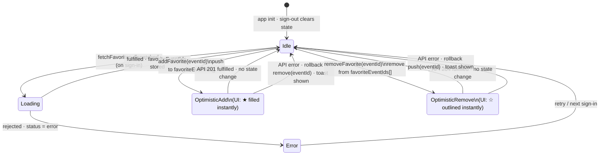

---

## 6. Backend Module Structure (`pantry-registration-api-node`)

New NestJS module layout for the favorites feature.

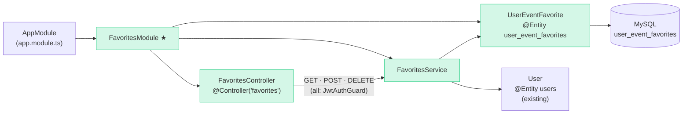

---

_Generated alongside PRD revision — May 2026. Update diagrams when implementation decisions change._
